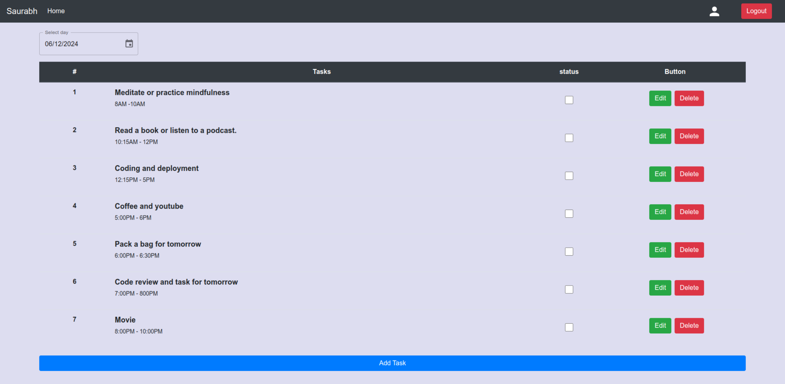

Daily ToDo list is website that tracks completion status of your tasks daily. It is build with react for front end, express for server, postgres for database and prisma for ORM.



### Installing

```bash
npm install
```

### Run project

## For front end
```bash
cd client && cp .env.example .env
```
```bash
npm start
```

## For server

Open new terminal
```bash
cd server && cp .env.example .env
```

add postgres connection string in .env
```bash
npx prisma generate
```
```bash
npx prisma migrate dev --name < -give any name- >
```
start the project
```bash
npm start
```
<P align="center">OR</P>

```bash
nodemon
```


